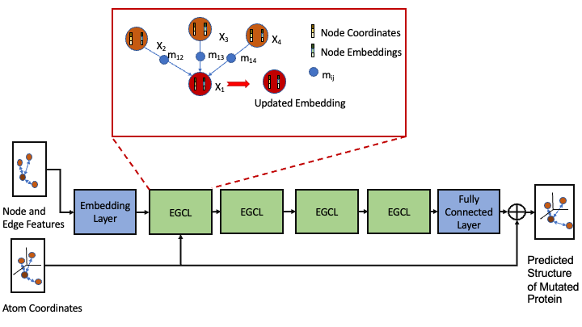

# PreMut
<p align="center">
  
</p>
Accurate prediction of single-site mutation induced changes on protein structures with equivariant graph neural networks. PreMut takes as input a wild-type protein structure and the mutation information to predict the structure of the mutated protein. 

## Installation
* Setup environment by running the following command
```
conda env create -f environment.yml
```

## Make prediction

* To make a prediction, save the wild pdb file in a folder and create a folder to save the prediction.
* Run the following command
```
python src/prediction.py wild_pdb_path mutation_info chain_id output_dir
```
* Here wild_pdb_path is the path to the wild pdb file (e.g. /path/to/1ert.pdb), mutation_info is the information regarding the wild residue, mutated position (0 indexed) and the mutated residue (e.g. D_59_N), chain_id is the id of the chain in the wild pdb file (e.g. A), and output_dir is the directory to save the predicted PDB file.
* Example
```
python src/prediction.py /path/to/1ert.pdb D_59_N A predictions
```

## Training
* Download and install TM-score and TM-align from this link: (https://zhanggroup.org/TM-score/, https://zhanggroup.org/TM-align/)
* Download all the files in the MutData2022 and MutData2023 datasets from the link (https://zenodo.org/record/8401256). Uncompress the files, and then move the uncompressed folders to the root directory of the PreMut repository.
* Run the following command to train the model
```
python src/train.py

```
* After the completion of training, the model weights are stored in a folder titled Checkpoints.
* You can select the model with the best validation performance from the Checkpoints folder to test.
## Evaluation
* Evaluation script is provided to check the reported performance in the paper.
* Make sure the files are downloaded, uncompressed and moved to the root of the directory as instructed in the previous section.
* To get the evaluation metrics on MutData2022_test dataset, run this command
```
python Evaluation.py MutData2022
```
* To get the evaluation metrics on MutData2023_test dataset, run this command
```
python Evaluation.py MutData2023
```


